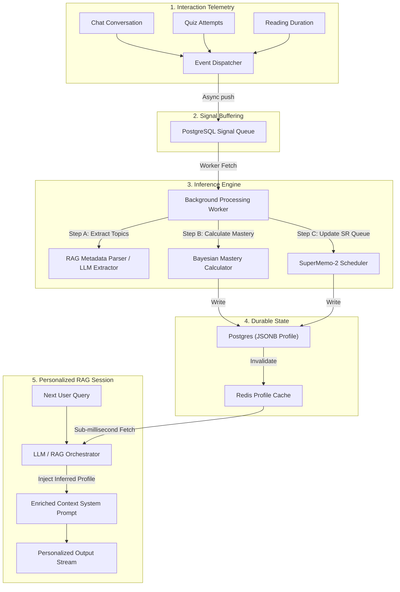

# OpenBALC — User Learning Framework (ULF) Specification

The **User Learning Framework (ULF)** is a passive, inference-based personalization system. It builds a multi-dimensional cognitive profile of a user's skills, weak points, domain interests, and studying style entirely from context cues—**without explicit forms, questionnaires, or survey gates.**

This document details the architecture, math, data storage models, and integration protocols for OpenBALC's cognitive profiling pipeline.

---

## 1. System Architecture

The ULF processes interaction data out-of-band to ensure zero impact on user interaction loops (e.g., chat streaming, quiz loading). 



---

## 2. Telemetry and Signal Capture

Telemetries are structured interactions translated into **cognitive signals**. 

### 2.1 Telemetry Signal Types
The pipeline listens for four main signal types:

1. **`chat_question`**: Extracted topic and complexity of a user inquiry. Represents curiosity or a potential knowledge gap.
2. **`test_answer`**: Performance data (correctness, speed, response time) on generated quizzes.
3. **`module_view`**: Document clicks, read time, and manual annotations. Indicates high-level interest.
4. **`nlp_cognitive`**: Linguistic cues extracted from chat text (e.g., phrasing expressing confusion or mastery).

### 2.2 Event Payload Schemas
Events are pushed to the `learning_signals_queue` with standard metadata. For example, a **`test_answer`** signal schema:

```json
{
  "user_id": 42,
  "signal_type": "test_answer",
  "module_id": 104,
  "topic_slug": "double_entry_bookkeeping",
  "domain": "accounting",
  "payload": {
    "question_id": 2045,
    "correct": false,
    "attempts": 2,
    "time_taken_ms": 42000,
    "points_possible": 10
  }
}
```

---

## 3. Storage Architecture & Collision Prevention

To prevent data collision where multiple modules share similar topic names (e.g., a "Variables" topic exists in both Python and JavaScript modules), the storage uses **namespace-scoping**.

Topics are uniquely stored and addressed using a composite key:
$$\text{key} = \text{module\_[module\_id]}:\text{[topic\_slug]}$$

### 3.1 PostgreSQL Profile Schema
The permanent profile is stored in the `user_learning_profiles` table. The core data is kept inside flexible JSONB fields to accommodate changing course selections:

*   **`topic_mastery`**: Houses precision scores, confidence, and timestamps.
    ```json
    {
      "module_104:double_entry": {
        "topic_id": 982,
        "score": 0.32,
        "confidence": 0.81,
        "last_updated": "2026-06-22T10:42:00Z"
      }
    }
    ```
*   **`interest_map`**: Tracks a user's affinity toward broader fields (e.g., `"accounting": 0.88`, `"computer_science": 0.21`).
*   **`revisit_queue`**: Active spaced-repetition schedules for weak areas.

*(See [superschema.sql](file:///home/soham/Documents/threnlabs/OpenBALC/superschema.sql) or [UserLearningProfile.sql](file:///home/soham/Documents/threnlabs/OpenBALC/UserLearningProfile.sql) for database definitions and indexing rules).*

---

## 4. Inference Engine Logic

When the background worker extracts an event from the queue, it executes three logical evaluation steps.

### 4.1 Topic Resolution
To avoid slow LLM processing for every telemetry item, the pipeline maps user interactions to unique database IDs by looking at RAG source metadata:
1. **Chat Interaction**: When the chat system answers a user's question, it keeps track of the retrieved RAG document chunks used to build the context.
2. **Metadata Lookup**: Each source document chunk has metadata referencing its parent `module_id` and specific parsed `topic_id`.
3. **Association**: The framework maps the signal directly to these IDs, preserving 100% database schema alignment.

### 4.2 Bayesian Mastery Calculation
Mastery scores (bounded between $0.0$ and $1.0$) represent the system's belief that a user understands a topic. They are updated when feedback occurs:

$$M_{new} = \text{clamp}\left(0.0, \, M_{old} \cdot D_{decay} + \Delta, \, 1.0\right)$$

Where:
*   $M_{old}$: The current mastery score.
*   $D_{decay}$: Recency decay factor (e.g., $0.995$ per day elapsed since the last update) to model memory loss over time.
*   $\Delta$: The feedback delta score, calculated as:
    $$\Delta = \begin{cases} 
      +W_{signal} \times 0.15 & \text{for positive signals (correct answer, mastery NLP)} \\
      -W_{signal} \times 0.12 & \text{for negative signals (incorrect answer, confusion NLP)} \\
      0 & \text{for neutral signals}
    \end{cases}$$
*   $W_{signal}$: The signal weight defined in the taxonomy (e.g., $1.0$ for tests, $0.5$ for chat questions).

```
Mastery Score Classifications:
[0.00] ─────────── [0.35] ─────────────────────── [0.70] ─────────── [1.00]
         Weak                 Learning               Strong
```

### 4.3 Spaced Repetition Scheduling (SM-2)
When a topic is flagged as "Weak" ($M < 0.35$), it is added to the user's `revisit_queue`. The next check date is scheduled using the SuperMemo-2 algorithm:

1. **Calculate Quality ($q$)**: Map quiz performance or interaction depth to a score of $0$ (complete blackout) through $5$ (perfect response).
2. **Compute Interval ($I$) and Ease Factor ($EF$)**:
   $$\text{For repetition count } n:$$
   $$I(n) = \begin{cases}
     1 & n = 1 \\
     6 & n = 2 \\
     I(n-1) \cdot EF & n > 2
   \end{cases}$$
   $$EF_{new} = \max\left(1.3, \, EF_{old} + \left(0.1 - (5 - q) \cdot (0.08 + (5 - q) \cdot 0.02)\right)\right)$$

---

## 5. RAG Pipeline Integration

The primary value of ULF is injecting user profiles into the active RAG conversation without increasing system latency.

```
          ┌──────────────────────────────────────────┐
          │             User Query                   │
          └──────────────────────────────────────────┘
                               │
                               ▼
          ┌──────────────────────────────────────────┐
          │          RAG Retrieve (Dense+Sparse)     │
          └──────────────────────────────────────────┘
                               │
                               ▼
          ┌──────────────────────────────────────────┐
          │         Redis Profile Context Fetch      │
          └──────────────────────────────────────────┘
                               │
                               ▼
          ┌──────────────────────────────────────────┐
          │       Prompt Builder / Context Injection  │
          └──────────────────────────────────────────┘
                               │
                               ▼
          ┌──────────────────────────────────────────┐
          │           LLM Generation Stream          │
          └──────────────────────────────────────────┘
```

### 5.1 Context System Prompt Injection
On every chat generation step, the orchestrator performs a fast key lookup in Redis:
`GET user:profile:[userId]`

If found, it appends a structured profile block to the system instructions. This prompt uses minimal tokens while adjusting LLM responses:

```
# USER PROFILE CONTEXT (DO NOT REVEAL TO USER)
- Learning Level: "Intermediate" in Accounting.
- User Strengths: module_104:double_entry, module_104:t_accounts (Assume high proficiency, avoid basic definitions, explain changes concisely).
- User Weaknesses: module_104:depreciation_methods, module_104:cash_flow_statement (Provide detailed scaffolding, step-by-step examples, and verify definitions).
- Style: Prefers illustrative examples before theoretical abstract rules.
```

### 5.2 Retrieval Reranking Modification
The cognitive profile is also used to adjust search results. The reranker score of document chunks is adjusted by the user's interest profile:

$$\text{FinalScore} = \text{RerankerScore} \times \left(1.0 + \alpha \cdot \text{InterestValue}\right)$$

Where:
*   $\text{InterestValue}$: The user's interest score for the chunk's domain (e.g., $0.8$ for Accounting).
*   $\alpha$: A tuning factor (e.g., $0.15$) to prevent search results from ignoring relevant topics in unfamiliar fields.

---

## 6. Privacy & Open Source Auditing

Because ULF profiles users implicitly, transparency is essential:
1. **Opt-Out Control**: Users can disable tracking via their account settings. Doing so deletes their `user_learning_profiles` row and halts event logging.
2. **Manual Corrections**: A dashboard allows users to view their strengths/weaknesses and manually correct any misclassifications (e.g., resetting a topic's status to "Unstudied").
3. **Local Scope**: Data is workspace-scoped and user-scoped. Profile summaries are not pooled to train models.
